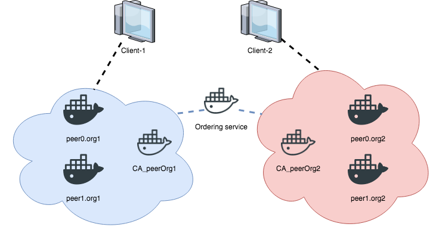
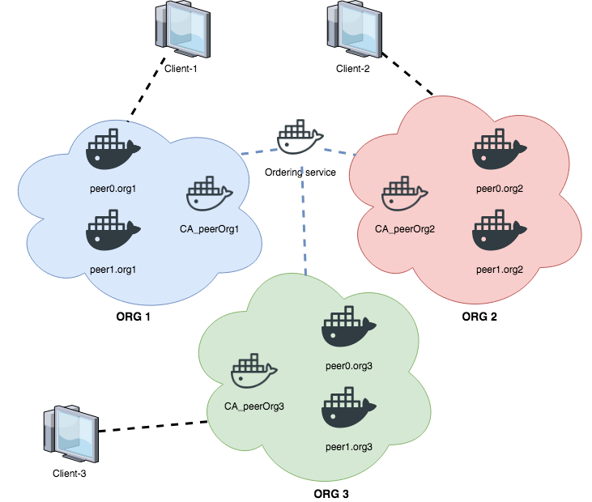

# hyperledger-fabric-add-orgs
Code for adding new organizations to Hyperledger Fabric

Firstly, we need to prepare the scenary (generate crypto material and raise the network):
```bash
./byfn.sh -m down
./byfn.sh -m generate
./byfn.sh -m up
```

The first architecture snapshot is as follows:



Our desired state is the following:



In order to do this, we need to generate the crypto material for the third org:
```bash
cd org3-artifacts
cryptogen generate --config=./org3-crypto.yaml
```
> NOTE: add the fabric tools (cryptogen, configtxgen, ...) to your PATH

Now export your FABRIC_CFG_PATH in order to have your configtx.yaml file for the Org3 (folder org3-artifacts):
```bash
export FABRIC_CFG_PATH=$PWD
```

And then, perform the following commands to configure our 3rd Organization; and copy the orderer crypto config into the crypto material of the Org3:
```bash
configtxgen -printOrg Org3MSP > ../channel-artifacts/org3.json
cp -r ../crypto-config/ordererOrganizations crypto-config
```

Now let's jump into the cli container (check the TIMEOUT to maintain the cli alive) and do the updates on the channel:
```bash
docker exec -it cli bash
```

Inside, install jq and start the configtxlator tool to reconfigure our topology:
```bash
apt update && apt install jq
configtxlator start &
# (Press enter to continue normally)
export CONFIGTXLATOR_URL=http://127.0.0.1:7059
export ORDERER_CA=/opt/gopath/src/github.com/hyperledger/fabric/peer/crypto/ordererOrganizations/example.com/orderers/orderer.example.com/msp/tlscacerts/tlsca.example.com-cert.pem
export CHANNEL_NAME=mychannel
```

Now start the funny and tedious reconfiguration (inside the cli):
```bash
# fetch the configuration block (most recent config block)
peer channel fetch config config_block.pb -o orderer.example.com:7050 -c $CHANNEL_NAME --tls --cafile $ORDERER_CA

# Turn it into editable json. We will use the jq tool to do this
curl -X POST --data-binary @config_block.pb "$CONFIGTXLATOR_URL/protolator/decode/common.Block" | jq . > config_block.json

# Remove unnecessary elements from the block (header, channel info, signatures, etc...)
jq .data.data[0].payload.data.config config_block.json > config.json

# Append the org.json file we generated earlier to the config.json
jq -s '.[0] * {"channel_group":{"groups":{"Application":{"groups":{"Org3MSP":.[1]}}}}}' config.json ./channel-artifacts/org3.json >& updated_config.json

# Now, ORG3 has been added to the groups. Turn config.json and updated_config.json back into a protobuffer.
curl -X POST --data-binary @config.json "$CONFIGTXLATOR_URL/protolator/encode/common.Config" > config.pb
curl -X POST --data-binary @updated_config.json "$CONFIGTXLATOR_URL/protolator/encode/common.Config" > updated_config.pb

# We want to now find the difference between config.pb and updated_config.pb so that we can isolate just the ORG3 information.
curl -X POST -F channel=$CHANNEL_NAME -F "original=@config.pb" -F "updated=@updated_config.pb" "${CONFIGTXLATOR_URL}/configtxlator/compute/update-from-configs" > config_update.pb

# Now we will turn config_update.pb back into json:
curl -X POST --data-binary @config_update.pb "$CONFIGTXLATOR_URL/protolator/decode/common.ConfigUpdate" | jq . > config_update.json

# wrap all the stuff that we stripped down back on to it, and put it back to protobuffer:
echo '{"payload":{"header":{"channel_header":{"channel_id":"mychannel","type":2}},"data":{"config_update":'$(cat config_update.json)'}}}' | jq . > config_update_in_envelope.json
curl -X POST --data-binary @config_update_in_envelope.json "$CONFIGTXLATOR_URL/protolator/encode/common.Envelope" > config_update_in_envelope.pb

# We must now sign this as ORG1 admin before adding to channel (environment variables for ORG1 are already into the cli).
peer channel signconfigtx -f config_update_in_envelope.pb
```

Now, go to the Org2 (inside the cli), and update the configuration (if you have more Org you must ensure this step per Org)
```bash
export CORE_PEER_MSPCONFIGPATH=/opt/gopath/src/github.com/hyperledger/fabric/peer/crypto/peerOrganizations/org2.example.com/users/Admin\@org2.example.com/msp/
export CORE_PEER_ADDRESS=peer0.org2.example.com:7051
export CORE_PEER_LOCALMSPID="Org2MSP"
export CORE_PEER_TLS_ROOTCERT_FILE=/opt/gopath/src/github.com/hyperledger/fabric/peer/crypto/peerOrganizations/org2.example.com/peers/peer0.org2.example.com/tls/ca.crt
peer channel update -f config_update_in_envelope.pb -c $CHANNEL_NAME -o orderer.example.com:7050 --tls true --cafile $ORDERER_CA
```

Raise the 2 peers for the Org3, (and a Org3cli, not compulsory, but useful to have all the crypto material for the third org):
```bash
docker-compose -f docker-compose-org3.yaml up
```

Go to the **Org3cli** and join the new peers to the existing channel "mychannel" for the Org3 (you can use the Org3cli in order to avoid to export all the env variables):
```bash
docker exec -it Org3cli bash
export ORDERER_CA=/opt/gopath/src/github.com/hyperledger/fabric/peer/crypto/ordererOrganizations/example.com/orderers/orderer.example.com/msp/tlscacerts/tlsca.example.com-cert.pem
export CHANNEL_NAME=mychannel

# When you join a channel, you must start on the genesis block. We do this using the fetch command. Notice the 0, that is selecting the earliest block aka the genesis block
peer channel fetch 0 mychannel.block -o orderer.example.com:7050 -c $CHANNEL_NAME --tls --cafile $ORDERER_CA
peer channel join -b mychannel.block

# Join the peer 1 too. Change the certificate file before jumping in.
export CORE_PEER_TLS_ROOTCERT_FILE=/opt/gopath/src/github.com/hyperledger/fabric/peer/crypto/peerOrganizations/org3.example.com/peers/peer1.org3.example.com/tls/ca.crt
export CORE_PEER_ADDRESS=peer1.org3.example.com:7051
peer channel join -b mychannel.block
```
Back to peer0 and install the chaincode (version 2.0). 
```bash
export CORE_PEER_TLS_ROOTCERT_FILE=/opt/gopath/src/github.com/hyperledger/fabric/peer/crypto/peerOrganizations/org3.example.com/peers/peer0.org3.example.com/tls/ca.crt
export CORE_PEER_ADDRESS=peer0.org3.example.com:7051
peer chaincode install -n mycc -v 2.0 -p github.com/chaincode/chaincode_example02/go/
```

We have to define ORG3 as part of our emdorsement policy, so we'll update the version to 2.0 in all of our organizations (inside the original **cli**):
```bash
# in Org1
export CORE_PEER_MSPCONFIGPATH=/opt/gopath/src/github.com/hyperledger/fabric/peer/crypto/peerOrganizations/org1.example.com/users/Admin\@org1.example.com/msp/
export CORE_PEER_ADDRESS=peer0.org1.example.com:7051
export CORE_PEER_LOCALMSPID="Org1MSP"
export CORE_PEER_TLS_ROOTCERT_FILE=/opt/gopath/src/github.com/hyperledger/fabric/peer/crypto/peerOrganizations/org1.example.com/peers/peer0.org1.example.com/tls/ca.crt
peer chaincode install -n mycc -v 2.0 -p github.com/chaincode/chaincode_example02/go/

# in Org2
export CORE_PEER_MSPCONFIGPATH=/opt/gopath/src/github.com/hyperledger/fabric/peer/crypto/peerOrganizations/org2.example.com/users/Admin\@org2.example.com/msp/
export CORE_PEER_ADDRESS=peer0.org2.example.com:7051
export CORE_PEER_LOCALMSPID="Org2MSP"
export CORE_PEER_TLS_ROOTCERT_FILE=/opt/gopath/src/github.com/hyperledger/fabric/peer/crypto/peerOrganizations/org2.example.com/peers/peer0.org2.example.com/tls/ca.crt
peer chaincode install -n mycc -v 2.0 -p github.com/chaincode/chaincode_example02/go/
```

Now we have the version 2's installed on peer0 of ORG1, ORG2 and ORG3. We are now ready to upgrade:
```bash
peer chaincode upgrade -o orderer.example.com:7050 --tls $CORE_PEER_TLS_ENABLED --cafile $ORDERER_CA -C $CHANNEL_NAME -n mycc -v 2.0 -c '{"Args":["init","a","90","b","210"]}' -P "OR('Org1MSP.member', 'Org2MSP.member', 'Org3MSP.member')"
```
> NOTE: we are rewriting our initial state, if we want to preserve the state of version 1 we have to create an init method that doesn't altere the ledger!

TEST:
```bash
# go to Org3cli and execute the query:
peer chaincode query -C $CHANNEL_NAME -n mycc -c '{"Args":["query","a"]}'
# or the following invoke:
peer chaincode invoke -o orderer.example.com:7050 --tls $CORE_PEER_TLS_ENABLED --cafile $ORDERER_CA -C $CHANNEL_NAME -n mycc -c '{"Args":["invoke","a","b","10"]}
```

In summary:
---
1) Pull the most updated configuration block.
2) Parse the block to json.
3) Strip headers of the configuration block.
4) Append the org3.json definition.
5) Convert both the new config and old config back to protobuffer.
6) Calculate the change in the two protobuffers.
7) Decode back to json.
8) Wrap it back up with the headers.
9) Encode it back into protobuffer.
10) Sign it off with the original ORGS and update the Config block.
11) Install chaincode onto ORG3 peer (new version).
12) Install new chaincode version onto ORG1 and ORG2.
13) Use ORG1 or ORG2 to upgrade the chaincode to include ORG3 in the endorsement policy.

Author:
---
Alejandro M. López Rodríguez, based on official documentation.
